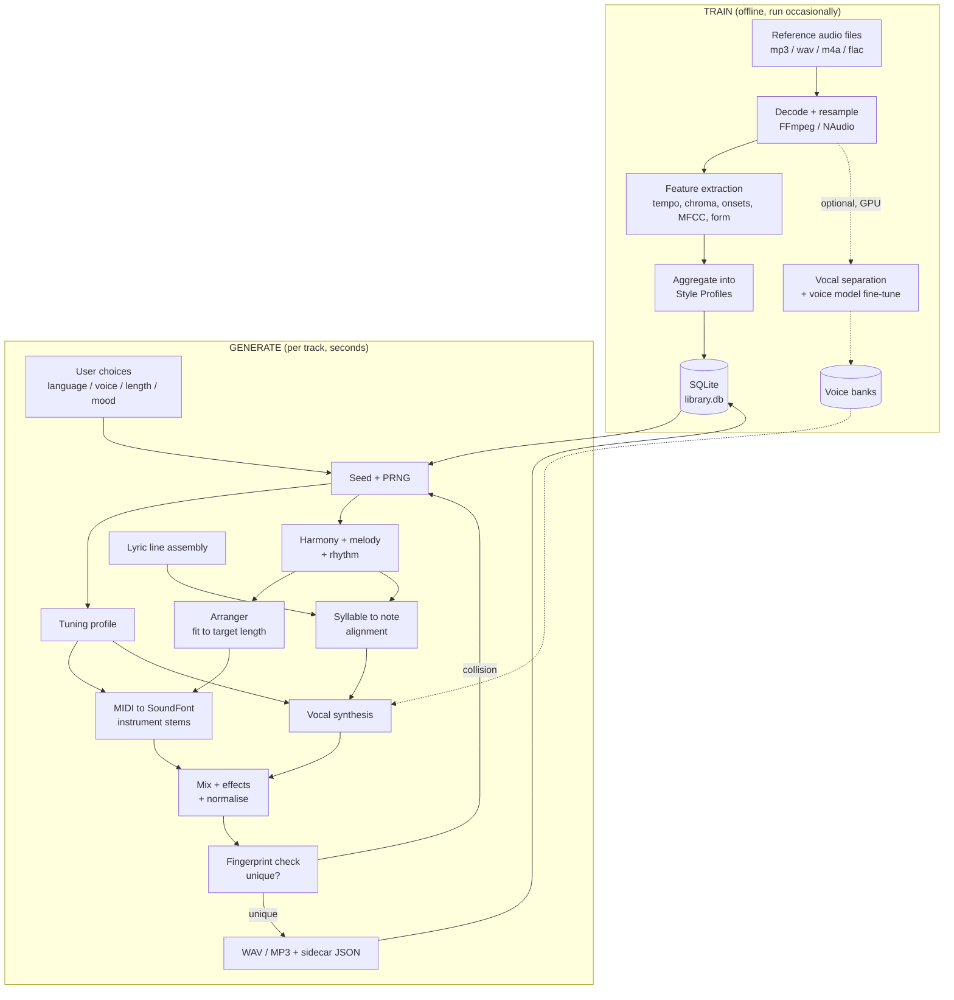

# Proof of Concept: AI-Assisted Multi-Language Music Track Generator

A Windows desktop application that generates original music tracks — instrumental plus sung
vocals — in English, Marathi, Hindi and Punjabi, learning its musical style from a library of
existing tracks supplied by the user.

---

## 1. Document control

| Field | Value |
|---|---|
| Document | Music Track Generator — Proof of Concept |
| Version | 1.0 (draft for review) |
| Date | 2026-08-19 |
| Status | Awaiting sign-off before Phase 0 |
| Type | Proof of Concept — throwaway-quality code, production-quality design |
| Implementation folder | `C:\study\MusicTrackGenPoc\` (local Windows machine) |
| This document | Stored in the repository so it can be reviewed and versioned |

> This document is the plan. No PoC code has been written yet. Section 17 lists the questions
> that should be answered before Phase 0 starts, but none of them block starting Phase 0–1.

---

## 2. Executive summary

The goal is an offline Windows desktop application where a user picks a **language**, a **voice
type** (male / female / child), a **track length** and a **mood**, presses *Generate*, and gets a
complete, original, playable song — different every single time — that sounds stylistically like
the reference music it was trained on.

The PoC reaches that goal with a **hybrid architecture** rather than a single end-to-end neural
model:

1. **A statistical style layer** learns measurable musical properties (tempo, key, scale/raga,
   chord transitions, rhythm density, instrumentation, dynamics, song form) from the user's
   existing tracks. This is fast, runs on CPU, needs no GPU, and — importantly for a PoC — is
   *inspectable*: you can look at what it learned and see that it learned something real.
2. **A procedural composition engine** samples from those learned distributions using a
   per-track random **seed**, so every generated track is provably distinct and every track is
   exactly reproducible from its seed.
3. **A pluggable vocal engine** sings the lyrics on the generated melody. The PoC ships a
   CPU-only tier built on Windows speech synthesis plus pitch/formant manipulation, behind an
   interface that a neural singing-voice model can be dropped into later without touching the
   rest of the application.

This split is the central design decision. An end-to-end neural "text → finished song" system is
a multi-month, GPU-heavy, data-hungry effort with an uncertain output quality; the hybrid gives a
**working, demonstrable, musically coherent application in roughly three weeks**, and leaves a
clean upgrade path to neural vocals as an optional Phase 6.

**Honest expectation setting:** in the base PoC, the *music* will sound like competent
generated backing music, and the *vocals* will sound synthetic and clearly machine-sung — good
enough to prove the pipeline end to end, not good enough to pass as a human singer. Section 6.6
and Section 15 explain exactly why, and what it takes to close that gap.

---

## 3. Objectives

### 3.1 In scope

| # | Objective | Source |
|---|---|---|
| O1 | Windows desktop application (not web, not CLI) | Stated requirement |
| O2 | Generate complete music tracks — melody, harmony, rhythm, arrangement | Stated requirement |
| O3 | Use existing tracks as the stylistic reference for the music | Stated requirement |
| O4 | Selectable singer voice: male, female, child | Stated requirement |
| O5 | Tracks in English, Marathi, Hindi, Punjabi | Stated requirement |
| O6 | Every generated track must be different from every previous one | Stated requirement |
| O7 | Every track gets its own unique tuning | Stated requirement |
| O8 | A separate training screen, including adding songs for training | Stated requirement |
| O9 | User-selectable track length | Stated requirement |
| O10 | Export the generated track to a normal audio file | Implied |
| O11 | Reproducibility — any generated track can be regenerated exactly | Added (needed to debug O6/O7) |

### 3.2 Out of scope for the PoC

- Mobile, web or cloud deployment.
- Multi-user accounts, licensing, or any commercial distribution of output.
- Real-time / live generation while playing (generation is a batch job with a progress bar).
- Cloning the voice of a specific, identifiable real singer (see Section 14).
- Mastering to commercial loudness/quality standards; stem-level DAW export.
- Any claim that generated output is copyright-clear for commercial release.

---

## 4. Requirements traceability

The request was a single paragraph. This table decomposes it so nothing is lost, and so each
line has a design element and a testable acceptance criterion.

| Req | Requirement (as stated) | Design element | Acceptance criterion |
|---|---|---|---|
| R1 | "application that can generate music tracks" | Composition engine + audio renderer (§6.3, §6.7) | Pressing *Generate* produces a playable audio file with melody, chords and percussion |
| R2 | "should use existing tracks for referring to music" | Analysis pipeline → style profiles (§6.2) | Generated tempo/key/progression statistics fall inside the distribution measured from the reference library |
| R3 | "singer voice and everything a song required" | Vocal engine + lyrics engine + mixer (§6.5, §6.6, §6.7) | Output contains audible sung vocals over the backing track |
| R4 | "generate a track with male, female, child voice" | `VoiceType` enum → voice bank / formant model selection (§6.6) | All three options produce measurably different fundamental-frequency ranges |
| R5 | "each track should be different" | Seeded generation + fingerprint uniqueness check (§8) | 200 consecutive generations produce 200 distinct fingerprints |
| R6 | "tracks in english, marathi, hindi, punjabi" | Per-language lyric banks, syllabifiers, voice selection (§6.5) | All four languages generate and render without fallback errors |
| R7 | "each time a track created should have unique tunning" | `TuningProfile` sampled per track (§8.2) | Two tracks never share the same tuning profile hash; profile is logged per track |
| R8 | "if want you can use AI to train it by using existing tracks" | Style training (always on) + optional neural voice fine-tuning (§6.8) | Style training completes on a 30-song library and visibly changes generated output |
| R9 | "separate option to train it and adding songs for training" | Dedicated *Train* tab with dataset manager and job queue (§10.3) | Songs can be added, analysed and trained from a screen separate from *Generate* |
| R10 | "we should select the track length" | Length-fitting arranger (§9) | Rendered duration is within ±0.5 s of the requested length |
| R11 | "should be a window desktop app" | WPF on .NET 10 (§11) | Runs as a native `.exe` on Windows 10/11, no browser, no server |

---

## 5. Solution overview



Two independent pipelines share one database. *Train* is slow and occasional; *Generate* is fast
and repeated. That separation is what makes R9 ("separate option to train it") natural rather
than bolted on.

---

## 6. Module design

### 6.1 Reference library and ingestion

**Purpose:** get user-supplied audio into a normalised, analysable form, with provenance
recorded.

- Accepts `.wav`, `.mp3`, `.m4a`, `.flac`, `.ogg` — individually or by folder scan.
- Decodes via a bundled FFmpeg executable (most permissive on formats) with `NAudio`
  `MediaFoundationReader` as fallback; normalises to mono, 22 050 Hz, 32-bit float for analysis
  (the original file is never modified and is only referenced by path).
- Records per file: path, duration, detected language (user-tagged, not auto-detected in the
  PoC), mood tag, and a **provenance/licence field the user must fill in** (Section 14).
- Rejects files shorter than 20 s or longer than 12 min, and files that fail to decode, with a
  clear reason shown in the dataset table.

### 6.2 Style analysis

**Purpose:** turn audio into numbers the composition engine can sample from. This is the module
that implements "use existing tracks for referring to music" (R2).

| Feature | Method | Used by |
|---|---|---|
| Tempo (BPM) | Spectral-flux onset envelope → autocorrelation → comb-filter peak picking | Arranger, rhythm |
| Key + mode | 12-bin chromagram → Krumhansl-Schmuckler profile correlation | Harmony |
| Scale / raga affinity | Chroma histogram matched against scale templates (major, minor, and raga templates: Bhairav, Yaman, Bhupali, Kafi, Asavari, Khamaj) | Melody |
| Chord progression | Beat-synchronous chroma → triad/seventh template matching → chord sequence → **first-order Markov transition matrix over scale degrees** (transposition-invariant, so profiles pool across songs in different keys) | Harmony |
| Rhythm pattern | Onset density per 1/16 grid position, per frequency band → per-drum-role probability vectors (kick, snare, hat, tabla, dholak) | Percussion |
| Timbre / instrumentation | MFCC mean + variance → nearest instrument-family cluster → SoundFont patch weights | Orchestration |
| Dynamics | RMS envelope + integrated loudness (LUFS) | Mixer, section levels |
| Song form | Chroma self-similarity matrix → novelty curve → section boundaries → *relative* section lengths | Arranger templates |

Features are aggregated into a **`StyleProfile`** keyed by `(language, mood)`. Aggregation keeps
mean and standard deviation for scalars, and normalised histograms / matrices for categorical
features — so generation samples a *distribution*, not a single song, which is what stops the
output being a copy of any one input.

Minimum viable library: **8 tracks per `(language, mood)` bucket**; recommended 25+. Below the
minimum the app falls back to a shipped default profile and says so in the UI.

The extracted profile is displayed in the Train tab (Section 10.3) as plain numbers. This is
deliberate — a PoC reviewer needs to *see* that training did something.

```jsonc
// Example StyleProfile record (abbreviated)
{
  "profileId": "hi-IN/romantic",
  "sourceTrackCount": 27,
  "tempoBpm": { "mean": 92.4, "sd": 7.1, "min": 78, "max": 108 },
  "modeHistogram": { "kafi": 0.37, "khamaj": 0.26, "minor": 0.22, "major": 0.15 },
  // 7x7 matrix: P(next scale degree | current scale degree), first row shown
  "degreeTransitions": [ [0.02, 0.14, 0.05, 0.22, 0.31, 0.18, 0.08] ],
  // 16 probabilities per drum role, one per 1/16 grid position, first 8 shown
  "rhythm": { "kick": [0.95, 0, 0, 0.10, 0.40, 0, 0, 0.05], "tabla": [] },
  "instrumentWeights": { "flute": 0.21, "sitar": 0.18, "strings": 0.31, "pad": 0.30 },
  // section label + fraction of total track length
  "formTemplates": [
    ["intro", 0.08], ["verse", 0.22], ["chorus", 0.25],
    ["verse", 0.20], ["chorus", 0.19], ["outro", 0.06]
  ],
  "loudnessLufs": -11.3
}
```

### 6.3 Composition engine

**Purpose:** produce a symbolic (MIDI-level) song from a style profile and a seed.

1. **Seed** — 64-bit, either user-supplied or `Guid.NewGuid()`-derived, hashed with SHA-256 and
   fed to a PCG/xoshiro PRNG. *Every* random decision downstream draws from this one stream, so
   the same seed reproduces the same song bit-for-bit (R11).
2. **Global parameters** — tempo sampled from the profile's clipped normal distribution; key
   uniform over 12; mode/raga sampled from the profile histogram; time signature 4/4 for the PoC
   (6/8 as a stretch goal).
3. **Harmony** — walk the profile's Markov matrix over scale degrees for the required number of
   bars, with two constraints: phrases must resolve to the tonic or dominant at section
   boundaries, and no chord may repeat more than three bars running.
4. **Melody** — not a random walk. A 2-bar **motif** is generated (constrained interval walk over
   the scale, contour drawn from a template set: arch, descending, ascending, wave), then the rest
   of the section is built by *varying* the motif — transposition to the current chord,
   inversion, rhythmic augmentation/diminution, ornamentation (grace notes, meend-style slides
   for the Indian-language profiles). This is the single biggest lever on whether output sounds
   intentional or sounds like noise.
5. **Vocal melody constraint** — for any bar carrying lyrics, the note count is set equal to the
   syllable count of the assigned lyric line (Section 6.4), so alignment is exact by
   construction rather than stretched afterwards.
6. **Percussion** — sample each 1/16 grid position per drum role against the profile's
   probability vector, then quantise-and-humanise per the tuning profile.
7. **Counter-parts** — bass line from chord roots with profile-driven rhythmic density; one or two
   pads/leads chosen by `instrumentWeights`.

Output is an in-memory `SongScore` object (sections → tracks → notes) which is then serialised
to MIDI via `Melanchall.DryWetMidi`.

### 6.4 Lyrics and language handling

The PoC does **not** attempt to be a lyricist. It assembles lyrics from curated, per-language
**phrase banks** shipped as editable JSON, or uses lyrics the user pastes in.

- Bank structure: `language → mood → {openers, verse lines, hook lines, closers}`, each entry
  tagged with its syllable count so the arranger can pick lines that fit a phrase length.
- Assembly: pick a hook, then verse lines whose syllable counts fit the available bars, applying
  a light rhyme-ending match where the bank provides ending tags. Repetition of the hook across
  choruses is intentional (that is what a chorus is).
- **User lyrics mode:** paste text, and the engine syllabifies and fits it; the melody adapts to
  the syllable counts rather than the reverse.

**Script and syllabification:**

| Language | Script | Syllabification approach |
|---|---|---|
| English | Latin | Vowel-group heuristic + CMU-style exception list |
| Hindi | Devanagari | Akshara segmentation (consonant + matra + halant handling) |
| Marathi | Devanagari | Same segmenter as Hindi; different phrase bank and stress rules |
| Punjabi | Gurmukhi | Gurmukhi akshara segmenter; Gurmukhi→Devanagari transliteration map available for the vocal fallback (§6.6) |

All UI and lyric rendering uses a font stack with Devanagari and Gurmukhi coverage (Nirmala UI on
Windows) — this needs to be set explicitly or the text renders as boxes.

### 6.5 Vocal engine — interface

Everything vocal sits behind one interface so the quality tier can be swapped without touching
the rest of the app. This is the most important seam in the design.

```csharp
public sealed record VocalRequest(
    IReadOnlyList<SungSyllable> Syllables,  // text + MIDI note + start + duration
    Language Language,
    VoiceType VoiceType,                    // Male | Female | Child
    TuningProfile Tuning,                   // reference pitch, vibrato, micro-detune
    int SampleRate);

public interface IVocalSynthesizer
{
    string Name { get; }

    // languages + voice types this tier actually supports
    VocalCapabilities Capabilities { get; }

    Task<AudioBuffer> SynthesizeAsync(
        VocalRequest request,
        IProgress<double>? progress,
        CancellationToken ct);
}
```

### 6.6 Vocal engine — three tiers

| Tier | Implementation | Cost | Quality | PoC status |
|---|---|---|---|---|
| **0** | Windows SAPI (`System.Speech.Synthesis`) renders each syllable → PSOLA/phase-vocoder pitch-shift to the target MIDI note with formant preservation (`SoundTouch.NET`) → time-stretch to note duration → crossfade concatenate → vibrato + reverb | CPU only, ~2 s per 30 s of vocal | Clearly synthetic, intelligible, on-pitch | **Ships in the PoC** |
| **1** | Python sidecar hosting an open-source singing-voice synthesis / conversion model (DiffSinger- or RVC-class), one voice bank per `(language, voiceType)`, JSON-RPC over stdio | Needs an NVIDIA GPU (≥8 GB) for training; inference workable on CPU but slow | Recognisably sung, musical | Interface + sidecar client built; models optional **Phase 6** |
| **2** | Cloud singing/TTS API adapter | Per-request cost, needs network | Vendor-dependent | Interface only, not implemented |

**Voice type is implemented as a timbre model, not as a person:**

| Voice type | Fundamental range | Formant scaling | Extra |
|---|---|---|---|
| Male | ~A2–A4 (110–440 Hz) | ×0.85 (longer vocal tract) | Slower vibrato, ~5 Hz |
| Female | ~A3–A5 (220–880 Hz) | ×1.00 (reference) | Vibrato ~5.5 Hz |
| Child | ~C4–C6, transposed +7…+9 semitones | ×1.25 (shorter tract) | Lighter vibrato, reduced breathiness, shorter phrases |

**Known Tier 0 language limitation — flagged early because it will be noticed in the demo.**
Windows SAPI voice coverage across these four languages is uneven: Hindi (`hi-IN`) voices are
available as a Windows language pack, but Marathi (`mr-IN`) and Punjabi (`pa-IN`) SAPI voices are
not reliably available. The fallback chain is:

1. Use the exact-language SAPI voice if installed.
2. Marathi → render through the Hindi voice (shared Devanagari script; pronunciation is
   approximate but broadly intelligible).
3. Punjabi → transliterate Gurmukhi → Devanagari, then render through the Hindi voice.
4. If no Indic voice at all is installed → render through the English voice with a phoneme
   approximation map, and **show a warning banner in the UI naming the missing language pack**.

The app must detect installed voices at startup and display the resolved chain per language in
*Settings*, so the demo never fails silently. Getting genuinely correct Marathi and Punjabi
pronunciation is a Tier 1 (Phase 6) outcome, and the doc should not pretend otherwise.

### 6.7 Audio rendering, mixing and export

- **Instruments:** `SongScore` → MIDI → `MeltySynth` (pure-managed SoundFont 2 renderer) using a
  bundled GM SoundFont plus a small set of Indian-instrument SF2 patches (sitar, bansuri, tabla,
  dholak, harmonium). One float buffer per instrument = a stem.
- **Mixer:** per-stem gain and pan from the style profile's section levels; vocal bus gets
  compression → de-esser (simple high-shelf dynamic) → plate reverb → delay; music bus gets a
  gentle bus compressor; sidechain duck of the music bus by the vocal bus (−2 dB) so vocals sit
  forward.
- **Master:** peak-limit at −1.0 dBTP, normalise to −14 LUFS integrated, fade in/out per section
  plan.
- **Export:** WAV (44.1 kHz / 16-bit) always; MP3 (320 kbps, `NAudio.Lame`) optional; MIDI export
  of the score for inspection; plus a **sidecar `.json`** containing seed, style profile id,
  tuning profile, chord sequence, lyrics and fingerprint. The sidecar is what makes R11
  (reproducibility) real and makes bugs diagnosable.
- **Metadata:** ID3/RIFF tags mark the file as machine-generated (Section 14).

### 6.8 Training module

Two distinct things are called "training", and the UI must not blur them:

**(a) Style training — always available, the default meaning of the *Train* button.**
Ingest → analyse (§6.2) → aggregate → write style profiles. CPU only, parallelised across files;
roughly **3–8 s per song**, so a 50-song library trains in a few minutes. Fully deterministic and
inspectable. This alone satisfies R8 and is what makes generated output take on the character of
the reference library.

**(b) Voice training — optional, Phase 6, GPU.**
Vocal stem separation (Demucs in the sidecar) → dataset slicing to 5–10 s clips → text/pitch
alignment → fine-tune a singing-voice model per `(language, voiceType)`. Hours per voice on a
consumer GPU. Requires clean, rights-cleared vocal source material (Section 14).

Both run as cancellable background jobs through a single job queue with progress reporting, so
the UI stays responsive and a long train can be abandoned safely.

---

## 7. Data model (SQLite)

```
ReferenceTracks(Id, Path, Title, Language, MoodTag, DurationSec, SampleRate,
                LicenceNote, ProvenanceNote, AddedUtc, AnalysisState, AnalysisError)

TrackFeatures(Id, ReferenceTrackId, TempoBpm, KeyRoot, Mode, LoudnessLufs,
              ChromaVectorJson, RhythmGridJson, MfccStatsJson, FormJson)

StyleProfiles(Id, ProfileKey, Language, MoodTag, SourceTrackCount, BuiltUtc, ProfileJson)

LyricPhrases(Id, Language, MoodTag, Role, Text, SyllableCount, EndingTag)

VoiceBanks(Id, Language, VoiceType, Tier, ModelPath, TrainedUtc, Notes)

GeneratedTracks(Id, CreatedUtc, Seed, StyleProfileId, Language, VoiceType,
                RequestedLengthSec, ActualLengthSec, TuningProfileJson,
                Fingerprint UNIQUE, ScoreJson, AudioPath, SidecarPath)

TrainingJobs(Id, Kind, State, StartedUtc, FinishedUtc, ItemsTotal, ItemsDone, LogPath, Error)
```

`GeneratedTracks.Fingerprint` carries a **UNIQUE** constraint — the uniqueness guarantee (R5) is
enforced by the database, not by hoping the PRNG behaves.

Accessed through EF Core with `Microsoft.Data.Sqlite`; the database lives at
`C:\study\MusicTrackGenPoc\data\library.db`.

---

## 8. Uniqueness and tuning — the two guarantees

R5 and R7 are explicit requirements, so they get explicit mechanisms rather than being an
emergent property of randomness.

### 8.1 "Each track should be different" (R5)

A **fingerprint** is computed from the *musical content*, deliberately ignoring things a listener
would not count as a difference:

```
fingerprint = SHA256(
      normalised melody interval sequence      // transposition-invariant
    + rhythm onset bitmap per instrument
    + chord degree sequence
    + section plan
    + lyric line ids
)
```

Transposition-invariance matters: the same tune in a different key is *not* a new song, and the
fingerprint correctly says so. On insert, a `UNIQUE` violation means collision → re-roll the seed
and regenerate (bounded to 8 attempts, then surface an error suggesting the library is too small
to support more variety). With a 30-song library the realistic parameter space is far larger than
any PoC-scale catalogue, so collisions should be vanishingly rare — the check exists to *prove*
the property, and to catch the real failure mode, which is a seeding bug that makes the PRNG
repeat.

### 8.2 "Unique tunning" (R7)

The word "tunning" in the request is ambiguous. It is read **both** ways, and both are
implemented, because each is cheap and the union is certainly what was meant:

- *Distinct melody/arrangement each time* — covered by §8.1.
- *Distinct tuning and performance character each time* — a **`TuningProfile`** sampled per track
  from the seed:

| Parameter | Sampled from | Audible effect |
|---|---|---|
| Reference pitch A4 | {432, 436, 440, 442, 444} Hz | Overall brightness/warmth |
| Temperament | {12-TET, just intonation, Pythagorean, 22-shruti approximation} | Harmonic colour; shruti option only for Indian-language profiles |
| Per-instrument micro-detune | ±3…18 cents | Chorus/width, "not a machine" feel |
| Timing humanisation | ±5…25 ms per note, per-instrument tightness | Groove, push/pull feel |
| Velocity humanisation | ±4…12 MIDI velocity | Dynamic life |
| Vocal vibrato | depth 15…60 cents, rate 4.5…6.5 Hz, onset delay 80…400 ms | Vocal expressiveness |
| Stretch tuning | 0…4 cents/octave | Piano/pad realism |

The complete profile is hashed into the track's sidecar JSON and shown in the UI ("Tuning: A=442
Hz, just intonation, +7 cents"), so R7 is not just claimed but visible and verifiable — and,
because it derives from the seed, exactly reproducible.

---

## 9. Track length control (R10)

1. User picks 0:30, 1:00, 2:00, 3:00, or a custom value in 15 s–5:00.
2. Bars required: `bars = round(targetSeconds × bpm / (60 × beatsPerBar))`.
3. A **form template** is chosen by length bucket, with relative section proportions drawn from
   the style profile's measured song form. For example, 2:00 at 92 BPM ≈ 46 bars →
   `Intro 4 | Verse 8 | Chorus 8 | Verse 8 | Chorus 8 | Bridge 4 | Chorus 4 | Outro 2`.
4. Residual bars are absorbed by extending or trimming intro/outro first, then bridge — never by
   cutting a chorus mid-phrase.
5. After render, a final tail trim plus fade lands the file **within ±0.5 s of the target**, which
   is the acceptance criterion. Short lengths (<0:45) automatically drop to a reduced template
   (`Intro | Verse | Chorus | Outro`) rather than compressing everything.

---

## 10. User interface

WPF, MVVM (`CommunityToolkit.Mvvm`), four tabs. Long operations always run off the UI thread with
progress and cancellation.

### 10.1 Generate tab

```
┌─ Generate ──────────────────────────────────────────────────────────────┐
│  Language   [ Hindi        ▾ ]     Voice     [ Female ▾ ]               │
│  Mood       [ Romantic     ▾ ]     Length    [ 2:00   ▾ ]  ( custom )   │
│  Style      [ hi-IN / romantic — 27 songs ▾ ]                           │
│                                                                         │
│  Lyrics     ( • ) Auto from phrase bank    ( ) I'll paste my own        │
│             ┌───────────────────────────────────────────────────────┐   │
│             │                                                       │   │
│             └───────────────────────────────────────────────────────┘   │
│                                                                         │
│  Seed       [ (random)          ]  ☐ Lock seed      [ Advanced… ]       │
│                                                                         │
│                        [   G E N E R A T E   ]                          │
│                                                                         │
│  ▸ Composing … arranging … synthesising vocals … mixing   ▓▓▓▓▓░░░ 62%  │
│                                                                         │
│  ┌ Result ─────────────────────────────────────────────────────────┐    │
│  │ ▶  ══════════●═══════════════════  1:14 / 2:00                  │    │
│  │ Key F# Kafi · 92 BPM · A=442 Hz just intonation · seed 8F31C0A2 │    │
│  │ [ Save WAV ] [ Save MP3 ] [ Export MIDI ] [ Regenerate ]        │    │
│  └─────────────────────────────────────────────────────────────────┘    │
└─────────────────────────────────────────────────────────────────────────┘
```

`Advanced…` exposes tempo override, key override, instrument on/off toggles and vocal
wet/dry — useful in a demo to show the engine is genuinely parameterised rather than replaying
canned output.

### 10.2 Library tab

Table of previously generated tracks: date, language, voice, length, key, tempo, tuning summary,
seed, fingerprint prefix. Play inline, reveal in Explorer, delete, and **"Regenerate from
seed"** — the visible proof of R11, and the fastest way to demonstrate R5 (regenerate gives an
identical file; generate again gives a different one).

### 10.3 Train tab (R9)

```
┌─ Train ─────────────────────────────────────────────────────────────────┐
│  [ + Add songs ]  [ + Add folder ]        Library: 27 songs · 1 h 52 m  │
│  ┌──────────────────────────────────────────────────────────────────┐   │
│  │ Title              Lang     Mood      Len    Licence   State     │   │
│  │ track_01.mp3       Hindi    Romantic  4:12   Owned     Analysed  │   │
│  │ track_02.wav       Marathi  Folk      3:48   Owned     Analysed  │   │
│  │ track_03.mp3       Punjabi  Upbeat    3:05   —         Needs tag │   │
│  └──────────────────────────────────────────────────────────────────┘   │
│                                                                         │
│  Training kind:  ( • ) Style profiles  (CPU, minutes)                   │
│                  (   ) Voice model     (GPU, hours — Phase 6)           │
│                                                                         │
│  [ Analyse selected ]   [ Build style profiles ]   [ Cancel job ]       │
│                                                                         │
│  Job: Building style profiles   ▓▓▓▓▓▓▓▓▓▓▓▓░░░░  19/27                 │
│                                                                         │
│  ┌ Learned profile: hi-IN / romantic ──────────────────────────────┐    │
│  │ Tempo 92.4 ± 7.1 BPM   ·  Loudness −11.3 LUFS                   │    │
│  │ Modes   Kafi 37% · Khamaj 26% · Minor 22% · Major 15%           │    │
│  │ Instr.  Strings 31% · Pad 30% · Flute 21% · Sitar 18%           │    │
│  │ Top progressions   I–V–vi–IV (18%) · i–iv–v–i (14%)             │    │
│  └─────────────────────────────────────────────────────────────────┘    │
│  Log:  [12:04:11] track_19.mp3 → 88 BPM, D minor, form 6 sections       │
└─────────────────────────────────────────────────────────────────────────┘
```

The "Learned profile" panel is not decoration — it is how a reviewer confirms that training is
real, and it turns the vague "if want you can use AI to train it" into something demonstrable in
30 seconds.

### 10.4 Settings tab

Output folder, SoundFont path, default sample rate/bitrate, **installed voice detection with the
resolved per-language fallback chain** (§6.6), sidecar enable/path, log level, clear cache.

---

## 11. Technology stack

Chosen to stay in the C# / .NET family already used in this repository, so there is one language
to debug and no server to run.

| Concern | Choice | Why |
|---|---|---|
| Language / runtime | C# on **.NET 10** | Matches existing project; current LTS-track SDK already installed |
| UI framework | **WPF** (`net10.0-windows`, `UseWPF`) | Fastest route to a working desktop app; mature MVVM, styling, data grids; fewer packaging surprises than WinUI 3. WinUI 3 is the alternative if a modern Fluent look matters more than velocity |
| MVVM | `CommunityToolkit.Mvvm` | Source-generated observables/commands, no boilerplate |
| Audio I/O, mixing, export | `NAudio` + `NAudio.Lame` | De-facto .NET audio library; playback, WAV/MP3 write, sample providers for the mixer |
| MIDI | `Melanchall.DryWetMidi` | Robust score construction and MIDI export |
| Instrument rendering | `MeltySynth` | Pure-managed SoundFont 2 synth — no native dependency, deterministic output |
| DSP / FFT | `FftSharp` (+ `MathNet.Numerics`) | Chromagram, onset detection, MFCC |
| Pitch / time manipulation | `SoundTouch.NET` | Formant-preserving pitch shift and time stretch for Tier 0 vocals |
| TTS (Tier 0) | `System.Speech.Synthesis` (SAPI) | In-box on Windows, no network, no cost |
| Decoding | Bundled **FFmpeg** exe | Broadest input format coverage |
| Database | **SQLite** via `Microsoft.Data.Sqlite` + EF Core | Single-file, zero-install, fits a desktop PoC |
| Logging | `Serilog` (rolling file) | Diagnosing generation runs after the fact |
| Tests | `xUnit` + `FluentAssertions` | Unit tests on the deterministic parts (§16) |
| Optional sidecar (Phase 6) | Python 3.11 + PyTorch, Demucs, SVS model | Neural vocals; isolated so its absence cannot break the app |

Bundled asset licences (SoundFonts especially) must be checked before shipping anything — a
GM SoundFont with a permissive licence (e.g. GeneralUser GS or FluidR3) should be used, not one of
unknown provenance.

---

## 12. Solution layout

```
C:\study\MusicTrackGenPoc\
├─ MusicTrackGen.sln
├─ src\
│  ├─ MusicTrackGen.App\            WPF: Views, ViewModels, DI bootstrap
│  ├─ MusicTrackGen.Core\           Domain models, interfaces, seeding, TuningProfile
│  ├─ MusicTrackGen.Analysis\       Decode, features, StyleProfile builder
│  ├─ MusicTrackGen.Composition\    Scales/ragas, harmony, melody, arranger, percussion
│  ├─ MusicTrackGen.Lyrics\         Phrase banks, syllabifiers, transliteration
│  ├─ MusicTrackGen.Vocal\          IVocalSynthesizer, SAPI tier, sidecar client
│  ├─ MusicTrackGen.Audio\          SoundFont render, mixer, effects, export
│  └─ MusicTrackGen.Data\           EF Core context, entities, repositories
├─ tests\MusicTrackGen.Tests\
├─ assets\
│  ├─ soundfonts\   (GM + Indian instrument SF2)
│  ├─ lyrics\       (en.json, hi.json, mr.json, pa.json)
│  └─ voicebanks\   (Phase 6)
├─ sidecar\                          Optional Python (Phase 6)
├─ data\            library.db · generated\ · cache\ · logs\
└─ docs\            this document, demo script
```

The layered split mirrors the Controllers / Services / Models / Data separation already used in
this repository, adapted for a desktop app: `App` is the presentation layer, the middle
assemblies are services, `Core` holds models, `Data` holds persistence.

---

## 13. Performance targets

On a typical developer laptop (4-core CPU, 16 GB RAM, **no GPU**):

| Operation | Target |
|---|---|
| Analyse one 4-minute reference track | ≤ 8 s |
| Build style profiles from a 30-song library | ≤ 3 min (parallelised) |
| Compose + render a 2-minute instrumental | ≤ 6 s |
| Tier 0 vocal synthesis for a 2-minute track | ≤ 20 s |
| Mix, master and export WAV + MP3 | ≤ 5 s |
| **End-to-end 2-minute track with vocals** | **≤ 35 s** |
| Application cold start | ≤ 3 s |
| Peak working set during generation | ≤ 1.5 GB |

Anything over ~60 s end-to-end makes the demo feel broken, so this is a design constraint, not
an aspiration: rendering is streamed per stem, and analysis results are cached by file hash so a
re-train only re-analyses changed files.

---

## 14. Legal, licensing and ethical constraints

These are design constraints for the PoC, recorded here so they are decided deliberately rather
than discovered late.

1. **Reference audio must be rights-cleared.** The app trains on whatever the user adds, so the
   dataset table has a mandatory provenance/licence field, and profiles record their source track
   count and ids. For the PoC, use tracks you own, tracks you created, or openly-licensed
   datasets (FMA, MTG-Jamendo, MUSDB18, Saraga for Indian classical). No scraping.
2. **No cloning of identifiable real singers.** Male / female / child are *timbre categories*
   built from formant and pitch models (§6.6), not impersonations of specific artists. A voice
   likeness is personal to its owner, and in many jurisdictions cloning one without consent is
   independently actionable regardless of the music copyright.
3. **Child voice: synthetic only.** The child voice is produced by pitch and formant
   transformation of a synthetic voice, never by training on recordings of a real child. If real
   child vocal recordings were ever used, documented guardian consent would be a hard
   precondition — for the PoC, the simpler and safer answer is that they are not used at all.
4. **Style versus copying.** Sampling from *aggregated distributions* over ≥8 songs, rather than
   reproducing any single song's melody, is a deliberate design choice, and the transposition-
   invariant fingerprint (§8.1) gives a mechanism to check output against a melody blocklist if
   that is ever needed. This reduces the risk of substantial similarity; it is not a legal
   clearance, and no output should be published commercially without review.
5. **Label the output.** Exported files carry metadata marking them machine-generated, and the
   sidecar JSON records the generating parameters. Several jurisdictions and most platforms now
   expect AI-generated audio to be disclosed.
6. **Everything local by default.** No audio leaves the machine; the cloud tier (§6.6) stays
   unimplemented, so there is no accidental upload path for user music.

---

## 15. Risks and mitigations

| # | Risk | Impact | Likelihood | Mitigation |
|---|---|---|---|---|
| 1 | **Tier 0 vocals sound too robotic to be convincing in a demo** | High | High | Set expectations in advance (this document); make the *music* excellent; keep the demo per-track short; have Phase 6 costed and ready as the answer to "can it sound real?" |
| 2 | Marathi / Punjabi SAPI voices unavailable on the demo machine | Medium | High | Detect at startup, show the resolved fallback chain, document the Hindi-voice fallback, verify the demo machine's language packs before the review |
| 3 | Generated music sounds random rather than musical | High | Medium | Motif-based melody with variation, not a free random walk (§6.3); phrase-boundary resolution constraints; A/B listening checkpoint at the end of Phase 1 before vocals are built |
| 4 | Reference library too small → weak or degenerate profiles | Medium | Medium | Minimum 8 tracks per bucket enforced; shipped default profiles as fallback; the UI states which profile was actually used |
| 5 | Copyright exposure from the reference library | High | Medium | Mandatory provenance field; guidance to use owned or openly-licensed audio; distribution of output explicitly out of scope (§14) |
| 6 | Phase 6 blocked by GPU availability | Medium | Medium | Phase 6 is explicitly optional; Tiers are behind one interface so the PoC is complete without it |
| 7 | Scope creep into a full DAW (stems, automation, editing) | Medium | Medium | Non-goals listed in §3.2; `Advanced…` panel is the pressure valve for "can I tweak it?" |
| 8 | Beat/key detection inaccuracy corrupting profiles | Medium | Medium | Show per-track detected values in the Train log; allow manual override of BPM/key per reference track; discard outliers beyond 2 SD during aggregation |
| 9 | Bundled SoundFont / asset licences unclear | Medium | Low | Use a known permissively-licensed GM SoundFont; record asset licences in `assets\LICENSES.md` |

---

## 16. Delivery plan

Estimates are working days for one developer, and assume the .NET 10 SDK, Visual Studio and a
reference library of ~30 songs are available on day one.

| Phase | Deliverable | Exit criteria | Days |
|---|---|---|---|
| **0** | Solution skeleton: WPF shell, four tabs, DI, Serilog, SQLite migrations, audio playback of a file | App launches, plays a WAV, writes to `library.db` | 2 |
| **1** | Composition engine: scales/ragas, harmony, motif melody, percussion, arranger, MIDI → SoundFont render, seeded uniqueness, length fitting | *Generate* produces a distinct, playable **instrumental** at the requested length ±0.5 s | 4 |
| **2** | Analysis pipeline + style profiles + Train tab (style training, job queue, learned-profile panel) | 30 songs analysed in ≤3 min; generated output measurably shifts to match the profile | 3 |
| **3** | Lyrics banks for all four languages, syllabifiers, Tier 0 vocal synthesis, vocal bus, mixer, master, WAV/MP3 export | End-to-end **sung** track in each of the four languages, all three voice types | 4 |
| **4** | Library tab, fingerprint uniqueness enforcement, tuning profile surfacing, sidecar JSON, regenerate-from-seed, Settings + voice detection | 200-generation uniqueness test passes; regenerate-from-seed is bit-identical | 2 |
| **5** | Hardening, unit tests on deterministic parts, demo script, user notes | Demo (§18) runs start to finish without intervention | 2 |
| | **Base PoC total** | | **17** |
| **6** *(optional)* | Tier 1 neural vocals: Python sidecar, Demucs separation, dataset prep, per-`(language, voiceType)` fine-tune, sidecar client wiring | Neural vocals selectable in Settings; A/B against Tier 0 | 8–10 + GPU |

Testable-by-unit-test surfaces (the deterministic ones): seeding and PRNG reproducibility,
syllabifiers for all four scripts, length-to-bars arithmetic and template fitting, fingerprint
transposition-invariance, tuning profile sampling ranges, Markov walk constraint satisfaction.
Audio quality itself is assessed by listening checkpoints, not assertions.

---

## 17. Open questions

None of these block Phases 0–1, but answers are needed by the phase named.

| # | Question | Needed by | Default if unanswered |
|---|---|---|---|
| Q1 | Whose audio forms the reference library, and what are its rights? | Phase 2 | Openly-licensed datasets only |
| Q2 | Does the demo machine have an NVIDIA GPU (and how much VRAM)? | Phase 6 decision | Assume no GPU; Tier 0 only |
| Q3 | Which Windows language packs are installed on the demo machine? | Phase 3 | Assume English + Hindi; fallbacks for mr/pa |
| Q4 | "Unique tunning" — melody uniqueness, tuning system, or both? | Phase 1 | **Both** (§8.2) |
| Q5 | Should lyrics be generated, or will lyrics always be supplied? | Phase 3 | Phrase bank by default, paste-your-own supported |
| Q6 | Required export formats beyond WAV/MP3? Separate stems? | Phase 3 | WAV + MP3 + MIDI, no stems |
| Q7 | Must the app be fully offline? | Phase 0 | Yes — fully offline |
| Q8 | Moods to support beyond a starter set? | Phase 2 | Romantic, Upbeat, Sad, Devotional, Folk |

---

## 18. Acceptance criteria and demo script

### 18.1 Acceptance criteria

| # | Criterion | How it is verified |
|---|---|---|
| A1 | Runs as a native Windows desktop `.exe` | Launch on a clean Windows 11 machine |
| A2 | Generates a complete track with backing music and sung vocals | Listen to the output |
| A3 | All four languages generate and render | One track each; no fallback errors, warnings shown where fallback is used |
| A4 | Male, female and child voices are measurably distinct | Median F0 of the vocal stem differs by ≥ 4 semitones between types |
| A5 | 200 consecutive generations yield 200 distinct fingerprints | Automated test against the `UNIQUE` constraint |
| A6 | Each track reports a distinct tuning profile | Sidecar JSON inspection across 20 tracks |
| A7 | Rendered duration within ±0.5 s of the requested length | Automated test across 0:30 / 1:00 / 2:00 / 3:00 / custom |
| A8 | Training is a separate screen; songs can be added and trained there | Walk the Train tab |
| A9 | Training visibly changes output | Generate before and after training on a distinctly different library; compare reported tempo/mode/instrumentation |
| A10 | Regenerate-from-seed is bit-identical | Byte-compare two renders of the same seed |
| A11 | End-to-end 2-minute track in ≤ 35 s on the target laptop | Stopwatch, no GPU |
| A12 | Export produces a WAV that opens in any standard player | Windows Media Player / VLC |

### 18.2 Demo script (~10 minutes)

1. Launch the app; show the four tabs and the detected voice/language status in *Settings*.
2. *Train* tab — add a folder of Hindi romantic tracks, run **Analyse**, then **Build style
   profiles**; show the learned profile panel (92 BPM, Kafi-heavy, sitar/strings).
3. *Generate* tab — Hindi / Female / 2:00 / Romantic. Generate. Play. Point out the reported key,
   tempo and tuning, and how they track the learned profile.
4. Generate again with identical settings. Play. Different melody, different tuning — show the two
   fingerprints side by side (R5, R7).
5. Switch voice to **Child**, same seed locked. Play. Same song, different singer (R4).
6. Switch language to **Marathi**, then **Punjabi**, then **English** — one short 0:30 track each
   (R6). Where a voice pack is missing, show the fallback banner rather than hiding it.
7. Set length to 3:00 and generate; show the reported duration lands within half a second (R10).
8. *Library* tab — **Regenerate from seed** on an earlier track; byte-identical output (R11).
9. Export WAV and MP3; open the sidecar JSON to show seed, tuning, chords and lyrics.
10. Close on the honest summary: what the base PoC proves, and what Phase 6 adds.

---

## 19. Known limitations of the PoC

Stated plainly so the review does not have to discover them:

- **Vocals sound synthetic.** Tier 0 is intelligible and on-pitch, not human. This is the single
  largest gap and the reason Phase 6 exists.
- **Marathi and Punjabi pronunciation is approximate** where SAPI voices for those languages are
  not installed (§6.6).
- **Lyrics are assembled, not written.** The phrase banks give coherent, mood-appropriate lines;
  they are not a lyricist, and no language model is involved.
- **4/4 only**, one time signature, no tempo changes within a track.
- **No real instrument performance modelling** — SoundFont playback with humanisation, so a solo
  will not phrase like a human player.
- **Style transfer is statistical, not semantic.** The engine learns that a corpus is 92 BPM and
  Kafi-leaning; it does not understand *why* a song is moving.
- **Single-user, single-machine, no undo history** beyond regenerate-from-seed.

None of these prevent the PoC from answering the question it exists to answer: *can this
application generate distinct, style-matched, multi-language tracks of a chosen length with a
chosen voice, and can it be trained on our own music?*

---

## 20. Recommendation

Proceed with **Phases 0–5 (17 working days)** to produce the base PoC on CPU only, with a
listening checkpoint at the end of Phase 1 — before any vocal work — to confirm the generated
music is musically acceptable. That checkpoint is the cheapest possible off-ramp: if the
instrumental output is not convincing, no vocal effort has been spent yet.

Decide on **Phase 6** only after the base PoC review, when there is something concrete to judge
and the GPU question (Q2) has a real answer.

---

## Appendix A — Glossary

| Term | Meaning |
|---|---|
| Akshara | Orthographic syllable unit in Devanagari/Gurmukhi scripts |
| Chromagram | 12-bin representation of pitch-class energy over time |
| Cent | 1/100 of a semitone; the unit used for micro-detuning |
| F0 | Fundamental frequency — perceived pitch of a voice |
| LUFS | Loudness Units Full Scale — perceptual loudness measure |
| MFCC | Mel-frequency cepstral coefficients — compact timbre descriptor |
| Meend | Glide/portamento between notes in Indian classical music |
| Raga | Melodic framework in Indian classical music (scale plus characteristic movement) |
| Shruti | Microtonal interval; the 22-shruti system approximates classical Indian tuning |
| SoundFont (SF2) | Sample-based instrument bank format |
| SVS | Singing Voice Synthesis |
| 12-TET | Twelve-tone equal temperament — standard Western tuning |

## Appendix B — Core interfaces

```csharp
public enum VoiceType { Male, Female, Child }
public enum Language  { English, Hindi, Marathi, Punjabi }

public sealed record GenerationRequest(
    Language Language,
    VoiceType VoiceType,
    TimeSpan TargetLength,
    string MoodTag,
    string? StyleProfileId,
    string? UserLyrics,
    ulong? Seed);

public interface IStyleProfileStore
{
    Task<StyleProfile> GetAsync(Language language, string moodTag, CancellationToken ct);

    Task<StyleProfile> BuildAsync(
        IReadOnlyList<int> referenceTrackIds,
        IProgress<double>? p,
        CancellationToken ct);
}

public interface IComposer
{
    SongScore Compose(
        StyleProfile profile,
        GenerationRequest request,
        ulong seed,
        TuningProfile tuning);
}

public interface ITrackFingerprinter
{
    string Compute(SongScore score);   // transposition-invariant
}

public interface ITrackGenerator
{
    Task<GeneratedTrack> GenerateAsync(
        GenerationRequest request,
        IProgress<GenerationStage>? p,
        CancellationToken ct);
}
```

## Appendix C — Reference datasets (openly licensed)

| Dataset | Content | Note |
|---|---|---|
| FMA (Free Music Archive) | ~100 k tracks, CC-licensed | Good general style corpus; check per-track licence |
| MTG-Jamendo | ~55 k tracks with mood/genre tags | Tags align well with the mood buckets |
| MUSDB18 | 150 tracks with separated stems | Useful for validating vocal separation |
| Saraga | Annotated Indian art music (Carnatic/Hindustani) | Raga and tala annotations; useful for the Indic profiles |
| OpenSLR Indic corpora | Speech (not song) in Indic languages | Pronunciation reference for the syllabifiers |

Licences differ per dataset and per track — record the licence in the dataset table (§7) at
ingestion time, not later.
